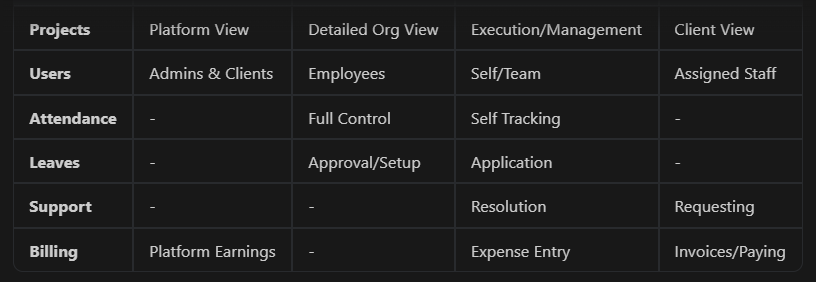

# Employee Task Management (ETM) System - Detailed Flow

This document provides a comprehensive overview of the Employee Task Management (ETM) system's architecture, user roles, and operational flows.

---

## 1. Authentication & Entry Point

- **Landing Page**: Users arrive at `/signin`.
- **Role-Based Access**: The login interface (`SignIn.jsx`) includes direct navigation links for **Admin**, **Employee**, and **Client**, facilitating easy access during development and demonstrations.
- **Super Admin Access**: A specialized high-level administrative interface accessible directly at `http://localhost:5173/super-admin`.

---

## 2. User-Specific Flows

### 👑 Super Admin Flow (`/super-admin`)

The platform's command center, typically utilized by platform owners or executive management.

- **Dashboard**: A bird's-eye view of platform-wide metrics such as total earnings, customer inquiries, and recent client acquisition.
- **Client Management**: Managing the full lifecycle of client organizations on the platform.
- **Admin Management**: Onboarding and oversight of organization-level Administrators.
- **Project Oversight**: High-level tracking of all projects running across different organizations.
- **Security**: Configuration of system-wide security policies and access controls.

### 🏛️ Admin Flow (`/admin`)

Focuses on internal organization management, human resources, and daily operations.

- **HR Management**:
  - **Attendance**: Managing daily check-ins and viewing detailed attendance sheets for the workforce.
  - **Leaves**: A dual-view system (HR and Managerial) for approving leave requests, tracking balances, and defining leave types.
  - **Employee Records**: Centralized management of the entire staff directory.
- **Organization Structure**:
  - **Departments**: Creating and managing the company's departmental hierarchy.
  - **Leadership**: Assigning team leaders and project managers to their respective roles.
- **Training & Development**: Overseeing the training ecosystem, including trainers, course lists, and trainee progress.
- **Operations**: Managing company-wide communication through notices and maintaining the holiday calendar.

### 🧑‍💻 Employee Flow (`/employee`)

The core execution layer where daily work and reporting take place.

- **Task Management**:
  - **My Tasks**: Personal dashboard for individual task tracking.
  - **Team Leader Tools**: Enhanced views for team leaders to assign and monitor team tasks.
  - **Project Management**: Specific modules for project managers to track project health and milestones.
- **Personal Portal**:
  - **My Leaves**: Applying for leaves and monitoring approval status.
  - **Performance Dashboard**: Personal overview of productivity and work metrics.
- **Support & Issue Resolution**:
  - **Issue Tracker**: A robust ticketing system used by leads and managers to resolve project blockers.
- **Financials**:
  - **Payments**: Reporting client payments and logging business-related expenses.

### 🤝 Client Flow (`/client`)

The external-facing portal for client transparency and collaboration.

- **Project Tracking**: Viewing real-time progress, timelines, and specific milestones of their projects.
- **Support & Communication**: Raising support tickets and interacting with the team via the "Supports" module.
- **Billing & Finance**: Accessing detailed billing history, invoices, and payment tracking.
- **Team View**: Seeing the specific personnel assigned to their projects for direct accountability.

---

## 3. Structural Flow Summary

---

## 📂 Technical Navigation Guide

- **Routing Logic**: Managed centrally in `frontend/src/App.jsx`.
- **Layout Architecture**: Found in `frontend/src/layout/`. Each user role has a dedicated layout containing its specific Sidebar and Navbar components.
- **Navigation Menus**: Sidebars are located in `frontend/src/components/[Role]/Sidebar/`, defining the links for each role's specific flow.
- **Functional Pages**: Role-specific logic and UI are located in `frontend/src/pages/[Role]/`.
